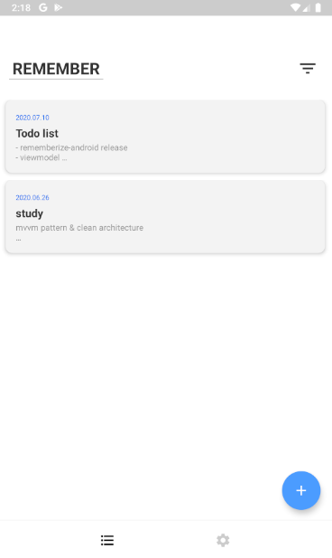
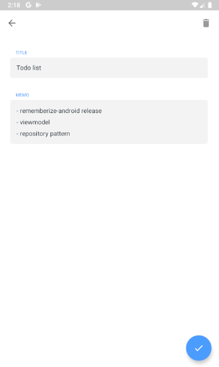
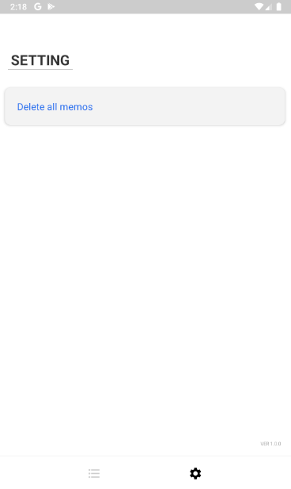

# 기억하기 (Rememberize)
> MVVM 패턴 및 모던 안드로이드 기술 학습을 위해 진행한 메모 앱 프로젝트 입니다.

    

## Current Version
- 1.4.0 (2021.01.24)

## 기능 
- 메모 추가 및 수정, 삭제 기능
- 테마 설정 기능 (Light / Dark)
- Pin 기능

## Stack
### Language
- Kotlin

### Architecture
- Clean Architecture
- MVVM Pattern

### Library
- Coroutine
- ViewModel
- LiveData
- Lifecycle
- Room
- Navigation
- Glide

## PlayStore
- [기억하기](https://play.google.com/store/apps/details?id=dev.lazyrabbit.rememberize)
